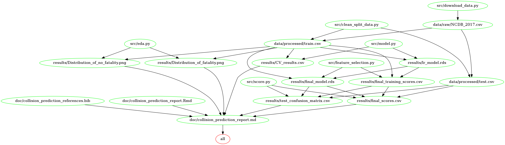

# Motor Vehicle Collision Fatality Predictor

* Authors: Abdul Moid Mohammed, Daniel King, Siqi Tao, Linh Giang Nguyen

## About

In this project we attempt to build a classification model using the
logistic regression algorithm and data obtained from police-reported
motor vehicle collisions on public roads in Canada to predict whether a motor vehicle
collision will result in a fatality or not. The final model performed
poorly on both the training set and the test set, returning a high
recall of 0.699, but a very low precision of 0.048, resulting in a low
f1-score of 0.09. The impact of the low precision can be seen in the
results of the prediction of the test set, where the model incorrectly
predicts fatalities around 20 times more than it correctly predicts
fatalities.

The data set that was used in this project came from the National Collision Database, published by Transport Canada, which can be found [here](https://open.canada.ca/data/en/dataset/1eb9eba7-71d1-4b30-9fb1-30cbdab7e63a). The National Collision Database contains data on all of the police-reported motor vehicle collisions on public roads in Canada from 1999 to the most recent available data from 2017. We ran our analysis using the data collected from collisions that occurred in 2017. This data set contains information licensed under the Open Government Licence – Canada.

The project proposal can be found [here](https://github.com/UBC-MDS/Collision_Prediction/blob/main/doc/proposal.md).

## Report

The final report can be found [here](https://github.com/UBC-MDS/Collision_Prediction/blob/main/doc/collision_prediction_report.md).

## Usage

There are two primary ways to replicate this analysis:

**1. Using Docker**

Install Docker, clone this GitHub repository, and run the following command from the command line/terminal within the root directory of this project:

```
docker run --platform linux/amd64 --rm -v /$(pwd):/home/jovyan/work test1 make -C /home/jovyan/work all
```

To reset the repo to a clean state without intermediate or results files, run the following command from the command line/terminal within the root directory of this project:

```
docker run --platform linux/amd64 --rm -v /$(pwd):/home/jovyan/work test1 make -C /home/jovyan/work clean
```

**2. Without using Docker**

Clone this GitHub repository and install the [dependencies](#Dependencies) listed below.

If .png rendering does not work, run this command prior to running the scripts:

```
npm install -g vega vega-cli vega-lite canvas
```

Run the following command at the command line/terminal from the root directory of this project:

```
make all
```

To reset the repo to a clean state without intermediate or results files, run the following command from the command line/terminal within the root directory of this project:

```
make clean
```

Makefile Dependencies Graph


## Dependencies

* Python 3.10.0 and Python packages:
  * altair=4.1.0=py_1
  * altair_saver==0.5.0
  * imbalanced-learn==0.8.1
  * pandas==1.3.4
  * pandoc==2.16.2
  * scikit-learn==1.0.1
  * docopt-ng==0.7.2
* R 4.0.3 and R packages:
  * kableExtra==1.3.4
  * knitr==1.36
  * tidyverse==1.3.1
* GNU Make 4.3

## License

The Motor Vehicle Collision Fatality Predictor materials here are licensed under the MIT License. If you use or re-mix this project please provide attribution and a link to this GitHub repository.
