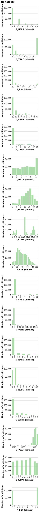
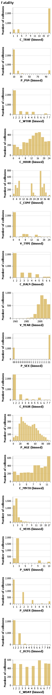

Predicting fatalities resulting from motor vehicle collisions
================
MDS-2021-22 Block 3 Group 21
25/11/2021

-   [Summary](#summary)
-   [Introduction](#introduction)
-   [Methods](#methods)
    -   [Data](#data)
    -   [Model](#model)
-   [Results & Discussion](#results--discussion)
-   [References](#references)

# Summary

In this project we attempt to build a classification model using the
logistic regression algorithm and data obtained from police-reported
motor vehicle collisions on public roads in Canada to predict whether a
collision would result in a fatality or not. The final model performed
poorly on both the training set and the test set, returning a high
recall of 0.698, but a very low precision of 0.048, resulting in a low
f1-score of 0.09. The impact of the low precision can be seen in the
results of the prediction of the test set, where the model incorrectly
predicts fatalities around 20 times more than it correctly predicts
fatalities.

# Introduction

Motor vehicle collisions are globally the eighth leading cause of death,
and in 2018 were the leading causes of death for people aged 5-29 years
old (WHO 2018). Each year an estimated 1.35 million people die due to
motor vehicle collisions, rising steadily to match the growth of the
world’s population (WHO 2018). In this project we seek to predict
whether motor vehicle collisions will result in fatalities based on a
number of factors including time of year, vehicle type, roadway
configuration, and traffic control. Answering this predictive research
question could have potential impacts on infrastructure policies and
driving laws, which could in turn save lives.

# Methods

## Data

The data set that was used in this project has been sourced from the
National Collision Database (“National Collision Database,” n.d.),
published by Transport Canada. The National Collision Database contains
data on all of the police-reported motor vehicle collisions on public
roads in Canada from 1999 to the most recent available data from 2017.
However, we ran our analysis using the data collected from collisions
that occurred in 2017. This data set contains information licensed under
the Open Government Licence – Canada.

## Model

The Logistic Regression algorithm was used to build a classification
model to predict whether a motor vehicle collision leads to a fatality
or not. All variables included in the original data set, with the
exception of “C_YEAR”, “C_CASE”, “C_SEV”, “P_ISEV”, “V_ID”, and “P_ID”
were used to fit the model, as these features were either irrelevant to
our prediction or contained redundant information. The “FATALITY” column
was created using the feature “C_SEV” by converting values that
correspond to at least one fatality to 1, and converting values that
correspond to an injury or no injury to 0. The “FATALITY” column served
as the target column to be predicted. In order to tackle the issue of
class imbalance and to perform cross-validations in feasible times with
our available computing power, we performed random undersampling using
`RandomUnderSampler`. Since all features were categorical, our pipeline
consisted of the `RandomUnderSampler`, a `OneHotEncoder`, and the
`LogisticRegression` model. We determined the optimal value of the
logistic regression model’s hyperparameter, *C*, using 5-fold cross
validation with random search `RandomizedSearchCV`. We further performed
feature selection using `RandomUnderSampler`, `OneHotEncoder`, `RFECV`,
and `LogisticRegression` model to reduce the number of features. The R
and Python programming languages (R Core Team 2019; Van Rossum and Drake
2009) and the following R and Python packages were used to perform the
analysis: knitr (Xie 2014), docopt (Keleshev 2014), os (Van Rossum and
Drake 2009), Pandas (McKinney 2010), scikit-learn (Pedregosa et al.
2011), imbalance-learn (Lema^itre, Nogueira, and Aridas 2017), Altair
(VanderPlas et al. 2018), Vegalite (Satyanarayan et al. 2017). The code
used to perform the analysis and create this report can be found here:
<https://github.com/UBC-MDS/Collision_Prediction>.

# Results & Discussion

In order to determine how the distribution of the features differ
between the two classes, we plotted bar charts to compare the
distribution of all features between `Fatality = False` and
`Fatality = True`. The associated data dictionary can be found
[here](https://open.canada.ca/data/en/dataset/1eb9eba7-71d1-4b30-9fb1-30cbdab7e63a/resource/09b74afc-2745-4382-8a02-3e256c4b28fd).

Promising features in which we can see a clear difference in the shape
of the distributions between collisions that are fatal and non-fatal
include V_YEAR, C_MNTH, C_RCFG, and P_AGE. However, we decided to use
all features in our model and to rely on recursive feature elimination
with cross-validation to eliminate features that are not important for
prediction.

<table class="table table-striped table-hover" style="width: auto !important; margin-left: auto; margin-right: auto;">
<caption>
Table 1. Cross-validation scores from the Logistic Regression model
before and after optimization
</caption>
<thead>
<tr>
<th style="text-align:left;">
Scoring Metric
</th>
<th style="text-align:left;">
Dummy Classifier
</th>
<th style="text-align:left;">
Logistic Regression
</th>
<th style="text-align:left;">
Logistic Regression Optimized
</th>
</tr>
</thead>
<tbody>
<tr>
<td style="text-align:left;">
fit_time
</td>
<td style="text-align:left;">
0.146 (+/- 0.006)
</td>
<td style="text-align:left;">
0.475 (+/- 0.023)
</td>
<td style="text-align:left;">
0.390 (+/- 0.032)
</td>
</tr>
<tr>
<td style="text-align:left;">
score_time
</td>
<td style="text-align:left;">
0.399 (+/- 0.032)
</td>
<td style="text-align:left;">
0.433 (+/- 0.013)
</td>
<td style="text-align:left;">
0.466 (+/- 0.058)
</td>
</tr>
<tr>
<td style="text-align:left;">
test_accuracy
</td>
<td style="text-align:left;">
0.985 (+/- 0.000)
</td>
<td style="text-align:left;">
0.766 (+/- 0.002)
</td>
<td style="text-align:left;">
0.767 (+/- 0.002)
</td>
</tr>
<tr>
<td style="text-align:left;">
test_f1
</td>
<td style="text-align:left;">
0.000 (+/- 0.000)
</td>
<td style="text-align:left;">
0.088 (+/- 0.002)
</td>
<td style="text-align:left;">
0.088 (+/- 0.001)
</td>
</tr>
<tr>
<td style="text-align:left;">
test_recall
</td>
<td style="text-align:left;">
0.000 (+/- 0.000)
</td>
<td style="text-align:left;">
0.741 (+/- 0.020)
</td>
<td style="text-align:left;">
0.741 (+/- 0.015)
</td>
</tr>
<tr>
<td style="text-align:left;">
test_precision
</td>
<td style="text-align:left;">
0.000 (+/- 0.000)
</td>
<td style="text-align:left;">
0.047 (+/- 0.001)
</td>
<td style="text-align:left;">
0.047 (+/- 0.001)
</td>
</tr>
<tr>
<td style="text-align:left;">
test_average_precision
</td>
<td style="text-align:left;">
0.015 (+/- 0.000)
</td>
<td style="text-align:left;">
0.090 (+/- 0.006)
</td>
<td style="text-align:left;">
0.090 (+/- 0.006)
</td>
</tr>
</tbody>
</table>

To create a baseline model to which we could compare out logistic
regression model, we used a dummy classifier which predicts the most
frequent class, non-fatalities. As seen in table 1, the dummy classifier
has a high accuracy, which is expected because it correctly predicts the
most frequent class. What is much more important is that the dummy
classifier has f1, recall, and precision scores of 0 because it never
correctly predicts the class of interest, fatalities. We can see that
the logistic regression model performs slightly better in this regard
with an f1 score of 0.088 (+/- 0.002) but this is still extremely low.
The logistic regression model has a decent recall of 0.741 (+/- 0.020)
but a very poor precision of 0.047 (+/- 0.001) which is dragging down
the f1 score. What these results mean is that the model correctly
predicts when a collision results in fatalities a high amount of the
time, but out of the times it predicts fatality, more of the predictions
are actually false classifications of fatality. As seen in table 1,
after optimizing the logistic regression model’s C hyperparameter, the
model does not perform any better. Furthermore, the low average
precision, 0.090 (+/- 0.006), does not indicate that we can change the
prediction probability threshold to meaningfully increase precision.

<table class="table table-striped table-hover" style="width: auto !important; margin-left: auto; margin-right: auto;">
<caption>
Table 2. Scores obtained from the final logistic regression model
</caption>
<thead>
<tr>
<th style="text-align:left;">
score
</th>
<th style="text-align:right;">
accuracy
</th>
<th style="text-align:right;">
f1
</th>
<th style="text-align:right;">
recall
</th>
<th style="text-align:right;">
precision
</th>
<th style="text-align:right;">
average_precision
</th>
</tr>
</thead>
<tbody>
<tr>
<td style="text-align:left;">
training_scores
</td>
<td style="text-align:right;">
0.770
</td>
<td style="text-align:right;">
0.091
</td>
<td style="text-align:right;">
0.758
</td>
<td style="text-align:right;">
0.048
</td>
<td style="text-align:right;">
0.094
</td>
</tr>
<tr>
<td style="text-align:left;">
test_scores
</td>
<td style="text-align:right;">
0.768
</td>
<td style="text-align:right;">
0.090
</td>
<td style="text-align:right;">
0.698
</td>
<td style="text-align:right;">
0.048
</td>
<td style="text-align:right;">
0.106
</td>
</tr>
</tbody>
</table>
<table class="table table-striped table-hover" style="width: auto !important; margin-left: auto; margin-right: auto;">
<caption>
Table 3. Confusion matrix obtained from scoring the logistic regression
model on the test set
</caption>
<thead>
<tr>
<th style="text-align:left;">
actuals
</th>
<th style="text-align:right;">
non_fatal
</th>
<th style="text-align:right;">
fatal
</th>
</tr>
</thead>
<tbody>
<tr>
<td style="text-align:left;">
non_fatal
</td>
<td style="text-align:right;">
43849
</td>
<td style="text-align:right;">
13164
</td>
</tr>
<tr>
<td style="text-align:left;">
fatal
</td>
<td style="text-align:right;">
289
</td>
<td style="text-align:right;">
667
</td>
</tr>
</tbody>
</table>

The final logistic regression model was obtained by performing feature
selection on the optimized model. A comparison of the scores obtained
using this model on the training set and test set can be seen in table
2. The test scores are extremely similar to the training scores which
means that despite the model’s low scores it was at least able to
generalize well to new data. The confusion matrix seen in table 3
further highlights the problems with the model, where on the test set
the model predicts fatalities falsely around 20 times more than it
correctly predicts fatalities, which is expected due to the huge
disparity between precision and recall.

The low performance of the final logistic regression model shows that
there is a lot of room for growth in answering the set out predictive
research question. The poor final results of the model indicate that the
data may not be linearly separable. Future work that could be done to
address this problem and to improve the performance of the
classification model include feature engineering with sklearn’s
`PolynomialFeatures`, and using other non-linear model algorithms or an
ensemble of model algorithms such as decision trees, SVC, and random
forest classifiers.

# References

Keleshev, Vladimir. 2014. *Docopt: Command-Line Interface Description
Language*. <https://github.com/docopt/docopt>.

Lema^itre, Guillaume, Fernando Nogueira, and Christos K. Aridas. 2017.
“Imbalanced-Learn: A Python Toolbox to Tackle the Curse of Imbalanced
Datasets in Machine Learning.” *Journal of Machine Learning Research* 18
(17): 1–5. <http://jmlr.org/papers/v18/16-365.html>.

McKinney, Wes. 2010. “Data Structures for Statistical Computing in
Python.” In *Proceedings of the 9th Python in Science Conference*,
edited by Stéfan van der Walt and Jarrod Millman, 51–56.

“National Collision Database.” n.d. *Open Government Portal*.
<https://open.canada.ca/data/en/dataset/1eb9eba7-71d1-4b30-9fb1-30cbdab7e63a>.

Pedregosa, F., G. Varoquaux, A. Gramfort, V. Michel, B. Thirion, O.
Grisel, M. Blondel, et al. 2011. “Scikit-Learn: Machine Learning in
Python.” *Journal of Machine Learning Research* 12: 2825–30.

R Core Team. 2019. *R: A Language and Environment for Statistical
Computing*. Vienna, Austria: R Foundation for Statistical Computing.
<https://www.R-project.org/>.

Satyanarayan, Arvind, Dominik Moritz, Kanit Wongsuphasawat, and Jeffrey
Heer. 2017. “Vega-Lite: A Grammar of Interactive Graphics.” *IEEE
Transactions on Visualization and Computer Graphics* 23 (1): 341–50.

Van Rossum, Guido, and Fred L. Drake. 2009. *Python 3 Reference Manual*.
Scotts Valley, CA: CreateSpace.

VanderPlas, Jacob, Brian Granger, Jeffrey Heer, Dominik Moritz, Kanit
Wongsuphasawat, Arvind Satyanarayan, Eitan Lees, Ilia Timofeev, Ben
Welsh, and Scott Sievert. 2018. “Altair: Interactive Statistical
Visualizations for Python.” *Journal of Open Source Software* 3 (32):
1057. <https://doi.org/10.21105/joss.01057>.

WHO. 2018. *Global Status Report on Road Safety 2018*. World Health
Organization.

Xie, Yihui. 2014. “Knitr: A Comprehensive Tool for Reproducible Research
in R.” In *Implementing Reproducible Computational Research*, edited by
Victoria Stodden, Friedrich Leisch, and Roger D. Peng. Chapman;
Hall/CRC. <http://www.crcpress.com/product/isbn/9781466561595>.

