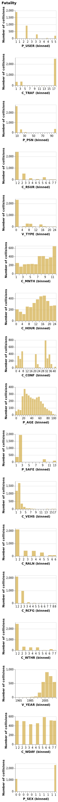

Predicting fatalities resulting from motor vehicle collisions
================
MDS-2021-22 block3 group21
25/11/2021

-   [Summary](#summary)
-   [Introduction](#introduction)
-   [Methods](#methods)
    -   [Data](#data)
    -   [Model](#model)
-   [Results & Discussion](#results--discussion)
-   [References](#references)

# Summary

We attempted to build a classification model using Logistic Regression,
which leverages the national collision database of Canada for 2017 to
predict whether a collision would result in a fatality or not. The final
model returned an accuracy score of 0.8 on the test data, however, it
achieved a high recall score: 0.739 but a low precision score: 0.022,
which is expected because the data set has a large amount of false
positives and, therefore, the model cannot accurately predict
fatalities. Thus, we recommend reviewing and improving this prediction
model to make better predictions.

<table class="table table-striped table-hover" style="width: auto !important; margin-left: auto; margin-right: auto;">
<caption>
Table 1. Confusion Matrix on the Test data
</caption>
<thead>
<tr>
<th style="text-align:left;">
actuals
</th>
<th style="text-align:right;">
non_fatal
</th>
<th style="text-align:right;">
fatal
</th>
</tr>
</thead>
<tbody>
<tr>
<td style="text-align:left;">
non_fatal
</td>
<td style="text-align:right;">
23071
</td>
<td style="text-align:right;">
5738
</td>
</tr>
<tr>
<td style="text-align:left;">
fatal
</td>
<td style="text-align:right;">
46
</td>
<td style="text-align:right;">
130
</td>
</tr>
</tbody>
</table>

# Introduction

Stemming from the frequent news we come across on fatalities due to
motor vehicle collisions, we thought about designing a model that would
help predict whether a motor vehicle collision would result in a
fatality or not. This lead to our predictive research question: “Will a
motor vehicle collision result in fatalities?”. Expanding upon this
question, we also ask: “What are the major contributors that predict a
fatal collision?” Through this predictive analysis we first aim to
predict whether a collision would result in a fatality or not followed
by determining what features are most important in making these
predictions. Specifically, we want to know how important month, roadway
configuration, weather condition, person age, and vehicle type are in
predicting the severity of a motor vehicle collision.

# Methods

## Data

The data set that will be used in this project has been sourced from the
National Collision Database (“National Collision Database,” n.d.),
published by Transport Canada. The National Collision Database contains
data on all of the police-reported motor vehicle collisions on public
roads in Canada from 1999 to the most recent available data from 2017.
We will start off our analysis using the data collected from collisions
that occurred in 2017. This data set contains information licensed under
the Open Government Licence – Canada.

## Model

The Logistic Regression algorithm was used to build a classification
model to predict whether a motor vehicle collision lead to a fatality or
not. All variables included in the original data set, with the exception
of “C_YEAR”, “C_CASE”, “C_SEV” were used to fit the model. The “P_ISEV”
column served as the target column to be predicted. The hyperparameter’s
*C* and *G**a**m**m**a* were chosen using 5-fold cross validation with
random search `RandomizedSearchCV`. In order to tackle the issue of
class imbalance, we performed random undersampling using
`RandomUnderSampler`. This helped us in determining the Logistic
Regression model with the best parameters. We further performed feature
selection using `RandomUnderSampler`, `OneHotEncoder`, `RFECV`, and
`LogisticRegression` model to reduce the number of features. The R and
Python programming languages (R Core Team 2019; Van Rossum and Drake
2009) and the following R and Python packages were used to perform the
analysis: knitr (Xie 2014), docopt (Keleshev 2014), os (Van Rossum and
Drake 2009), Pandas (McKinney 2010), scikit-learn (Pedregosa et al.
2011), Altair (VanderPlas et al. 2018), Vegalite (Satyanarayan et al.
2017). The code used to perform the analysis and create this report can
be found here: <https://github.com/UBC-MDS/Collision_Prediction>.

# Results & Discussion

In order to determine how the distribution of the features differ
between the two classes, we plotted bar charts to compare the
distribution of all features between `Fatality = False` and
`Fatality = True`. The associated data dictionary can be found
[here](https://open.canada.ca/data/en/dataset/1eb9eba7-71d1-4b30-9fb1-30cbdab7e63a/resource/09b74afc-2745-4382-8a02-3e256c4b28fd).

We chose to apply a logistic regression model on the data set and ran
hyper-parameter optimization to find the most optimized model; after
that, we applied RFECV for feature selection.

<table class="table table-striped table-hover" style="width: auto !important; margin-left: auto; margin-right: auto;">
<caption>
Table 2. Scores from the Logistic Regression model before and after
optimization
</caption>
<thead>
<tr>
<th style="text-align:left;">
score_type
</th>
<th style="text-align:left;">
lr_model
</th>
<th style="text-align:left;">
lr_model_optimized
</th>
</tr>
</thead>
<tbody>
<tr>
<td style="text-align:left;">
fit_time
</td>
<td style="text-align:left;">
0.216 (+/- 0.038)
</td>
<td style="text-align:left;">
0.168 (+/- 0.025)
</td>
</tr>
<tr>
<td style="text-align:left;">
score_time
</td>
<td style="text-align:left;">
0.369 (+/- 0.014)
</td>
<td style="text-align:left;">
0.373 (+/- 0.021)
</td>
</tr>
<tr>
<td style="text-align:left;">
test_score
</td>
<td style="text-align:left;">
0.792 (+/- 0.006)
</td>
<td style="text-align:left;">
0.796 (+/- 0.006)
</td>
</tr>
<tr>
<td style="text-align:left;">
train_score
</td>
<td style="text-align:left;">
0.792 (+/- 0.005)
</td>
<td style="text-align:left;">
0.796 (+/- 0.006)
</td>
</tr>
</tbody>
</table>
<table class="table table-striped table-hover" style="width: auto !important; margin-left: auto; margin-right: auto;">
<caption>
Table 3. Scores from the final Logistic Regression model
</caption>
<thead>
<tr>
<th style="text-align:left;">
scoring_metric
</th>
<th style="text-align:right;">
LR after Feature Selection
</th>
</tr>
</thead>
<tbody>
<tr>
<td style="text-align:left;">
accuracy
</td>
<td style="text-align:right;">
0.7990194
</td>
</tr>
<tr>
<td style="text-align:left;">
f1
</td>
<td style="text-align:right;">
0.0499085
</td>
</tr>
<tr>
<td style="text-align:left;">
precision
</td>
<td style="text-align:right;">
0.0257378
</td>
</tr>
<tr>
<td style="text-align:left;">
recall
</td>
<td style="text-align:right;">
0.8196429
</td>
</tr>
</tbody>
</table>
<table class="table table-striped table-hover" style="width: auto !important; margin-left: auto; margin-right: auto;">
<caption>
Table 4. Confusion Matrix from the final Logistic Regression model
</caption>
<thead>
<tr>
<th style="text-align:left;">
actuals
</th>
<th style="text-align:right;">
non_fatal
</th>
<th style="text-align:right;">
fatal
</th>
</tr>
</thead>
<tbody>
<tr>
<td style="text-align:left;">
non_fatal
</td>
<td style="text-align:right;">
207052
</td>
<td style="text-align:right;">
52124
</td>
</tr>
<tr>
<td style="text-align:left;">
fatal
</td>
<td style="text-align:right;">
303
</td>
<td style="text-align:right;">
1377
</td>
</tr>
</tbody>
</table>

In the future, we could do more work to fix this problem: (1) Feature
engineering: We can try `PolynomialFeatures` as the classes may not be
linearly separable; (2) Changing the threshold: Generate ROC and
Precision-Recall curves to determine if we can increase precision
without sacrificing recall by changing the prediction threshold; (3)
Trying a new model algorithm: The data may not be very linearly
separable and so we could also try a different classification model such
as decision tree or SVC.

# References

Keleshev, Vladimir. 2014. *Docopt: Command-Line Interface Description
Language*. <https://github.com/docopt/docopt>.

McKinney, Wes. 2010. “Data Structures for Statistical Computing in
Python.” In *Proceedings of the 9th Python in Science Conference*,
edited by Stéfan van der Walt and Jarrod Millman, 51–56.

“National Collision Database.” n.d. *Open Government Portal*.
<https://open.canada.ca/data/en/dataset/1eb9eba7-71d1-4b30-9fb1-30cbdab7e63a>.

Pedregosa, F., G. Varoquaux, A. Gramfort, V. Michel, B. Thirion, O.
Grisel, M. Blondel, et al. 2011. “Scikit-Learn: Machine Learning in
Python.” *Journal of Machine Learning Research* 12: 2825–30.

R Core Team. 2019. *R: A Language and Environment for Statistical
Computing*. Vienna, Austria: R Foundation for Statistical Computing.
<https://www.R-project.org/>.

Satyanarayan, Arvind, Dominik Moritz, Kanit Wongsuphasawat, and Jeffrey
Heer. 2017. “Vega-Lite: A Grammar of Interactive Graphics.” *IEEE
Transactions on Visualization and Computer Graphics* 23 (1): 341–50.

Van Rossum, Guido, and Fred L. Drake. 2009. *Python 3 Reference Manual*.
Scotts Valley, CA: CreateSpace.

VanderPlas, Jacob, Brian Granger, Jeffrey Heer, Dominik Moritz, Kanit
Wongsuphasawat, Arvind Satyanarayan, Eitan Lees, Ilia Timofeev, Ben
Welsh, and Scott Sievert. 2018. “Altair: Interactive Statistical
Visualizations for Python.” *Journal of Open Source Software* 3 (32):
1057. <https://doi.org/10.21105/joss.01057>.

Xie, Yihui. 2014. “Knitr: A Comprehensive Tool for Reproducible Research
in R.” In *Implementing Reproducible Computational Research*, edited by
Victoria Stodden, Friedrich Leisch, and Roger D. Peng. Chapman;
Hall/CRC. <http://www.crcpress.com/product/isbn/9781466561595>.

